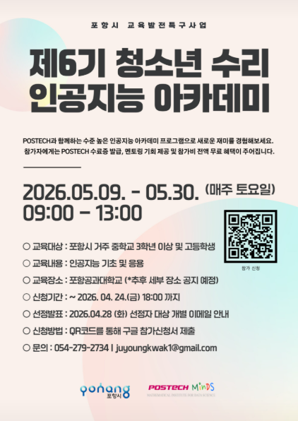

# 6회 포스텍청소년수리인공지능아카데미(2반)

## 강의 개요
**포항시** 가 주최하고 **포항공과대학교 수리데이터과학 연구소(POSTECH MINDS)** 가 위탁 운영하는 고등학생 대상 인공지능 교육 프로그램입니다. 인공지능의 기본 원리부터 실습 기반의 데이터 분석 및 모델 구축 경험을 제공하여, 지역 인재들이 미래 기술 역량을 갖출 수 있도록 돕습니다.  

|**주최**| 포항시|
|---|---|
|**운영**| 포항공과대학교 수리데이터과학 연구소|
|**대상**| 포항시 관내 고등학생  
|**기간**| 2026.05.09 ~ 2026.05.30 (총 4주/3시간)|  
|**장소**| 포항공과대학교 수리과학관 1층 강의실|

|총 참석인원|50명 (*운영인원 제외)|
|---|---|
|1반|17명(고2반)|
|2반|33명(고1&중3반)|

## 운영진 소개(2반)
| 담당 |이름|소속| 연락처 |
|---|---|---|---|
|교육 책임|정재훈 교수님|수학과|jung153@postech.ac.kr|
|행정 및 운영|곽주영 선생님|수학과|juyoungkwak0@postech.ac.kr|
|강사|이지호|인공지능대학원|jihlee@postech.ac.kr|
|강사|염시진|인공지능대학원|yeomsijin@postech.ac.kr|
|강사|박해룡|물리학과|phrphr@postech.ac.kr|
|강사|임재형|인공지능대학원|jaehyunglim@postech.ac.kr|
|강사|김병규|컴퓨터공학과|qudrb6989@postech.ac.kr|
|조교|한승완|수학과|han97@postech.ac.kr|
|조교|이정민|인공지능대학원|jungmin.lee@postech.ac.kr|
|조교|전병연|인공지능대학원|byungyunjeon@postech.ac.kr|

## 강의 계획

| 날짜 |차시|강사| 강의 내용 |강의 자료|
|---|---|---|---|---|
| [Day1]  2026.05.09 |1차시|염시진|인공지능과 함수|[6기_AI_Academy/main.tex](https://github.com/MINDS-edu/The-6th-POSTECH-Youth-Mathematical-Artificial-Intelligence-Academy-Class2/blob/master/6%EA%B8%B0_AI_Academy/main.tex)[[pdf](ai_and_fcn.pdf),[docx](ai_and_fcn.docx)] 
| |2차시|박해룡|회기 실습|[PYMAIA6_day1_파이썬_실습.ipynb](PYMAIA6_day1_파이썬_실습.ipynb)[[pdf](d1a.pdf)] [PYMAIA6_day1_선형회귀,로지스틱회귀.ipynb](PYMAIA6_day1_선형회귀,로지스틱회귀.ipynb)\[[pdf](d1b.pdf)]|
| [Day2] 2026.05.16  |1차시|임재형|인공지능 기초수학|[6기-2주차-1교시) 고등수학_예복습_발표자 임재형_260516.pptx](https://github.com/MINDS-edu/The-6th-POSTECH-Youth-Mathematical-Artificial-Intelligence-Academy-Class2/blob/master/6%EA%B8%B0-2%EC%A3%BC%EC%B0%A8-1%EA%B5%90%EC%8B%9C\)%20%EA%B3%A0%EB%93%B1%EC%88%98%ED%95%99_%EC%98%88%EB%B3%B5%EC%8A%B5_%EB%B0%9C%ED%91%9C%EC%9E%90%20%EC%9E%84%EC%9E%AC%ED%98%95_260516.pptx)[[pdf](6기-2주차-1교시%20고등수학_예복습_발표자%20임재형_260516.pdf)]|
|   |2차시|임재형|회귀 이론|[6기-2주차-2교시\) Regression_발표자 임재형_260516.pptx](https://github.com/MINDS-edu/The-6th-POSTECH-Youth-Mathematical-Artificial-Intelligence-Academy-Class2/blob/master/6%EA%B8%B0-2%EC%A3%BC%EC%B0%A8-2%EA%B5%90%EC%8B%9C\)%20Regression_%EB%B0%9C%ED%91%9C%EC%9E%90%20%EC%9E%84%EC%9E%AC%ED%98%95_260516.pptx)[[pdf](6기-2주차-2교시%20Regression_발표자%20임재형_260516.pdf)]|
|   |3차시|임재형|MLP 이론|[6기-2주차-3교시) MLP_발표자 임재형_260516.pptx](https://github.com/MINDS-edu/The-6th-POSTECH-Youth-Mathematical-Artificial-Intelligence-Academy-Class2/blob/master/6%EA%B8%B0-2%EC%A3%BC%EC%B0%A8-3%EA%B5%90%EC%8B%9C\)%20MLP_%EB%B0%9C%ED%91%9C%EC%9E%90%20%EC%9E%84%EC%9E%AC%ED%98%95_260516.pptx)[[pdf](6기-2주차-3교시%20MLP_발표자%20임재형_260516.pdf)]|
| [Day3] 2026.05.23 |1차시|이지호|CNN 이론|판서|
|  |2차시|전병연|인공 신경망과 천연 신경망|[present_school.pptx](present_school.pptx)[[pdf](present_school.pdf)] |
|  |3차시|박해룡|인공 신경망을 이용한 손글씨 분류| [PYMAIA6_day3_CNN_실습.ipynb](PYMAIA6_day3_CNN_실습.ipynb)[[pdf](d3a.pdf)]  [PYMAIA6_day3_LLM찍먹.ipynb](PYMAIA6_day3_LLM찍먹.ipynb)[[pdf](d3b.pdf)]|
| [Day4] 2026.05.30|1차시|김병규|LLM 이론|[LLM_수업_4주차_김병규.pptx](LLM_수업_4주차_김병규.pptx)[[pdf](LLM_수업_4주차_김병규.pdf)]|
| |2차시|염시진|AI의 가능성과 한계|x|

## 관련 링크
[Repository]   
[6기 1반](https://github.com/HiddenBeginner/The-6th-POSTECH-Youth-Mathematical-Artificial-Intelligence-Academy-Class1)  
[5기](https://github.com/MINDS-edu/The-5th-POSTECH-Youth-Mathematical-Artificial-Intelligence-Academy)  
[4기](https://github.com/MINDS-edu/The-4th-POSTECH-Youth-Mathematical-Artificial-Intelligence-Academy-Public)  
[3기](https://github.com/MINDS-edu/The-3rd-POSTECH-Youth-Mathematical-Artificial-Intelligence-Academy)  
[2기](https://github.com/MINDS-edu/2024_teenager_Math_AI_Acadmy)  
[Padlet]  
[6기 1반](https://padlet.com/94mostp/6-s8wli6hel40zgivy)  pw: postech  
[6기 2반](https://padlet.com/jihlee9/6-5kk675i5v8c1611f)  pw: postech

